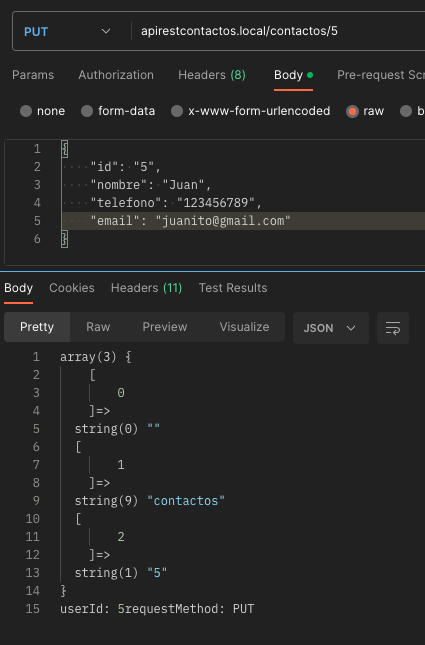

# Creación de una API REST de Contactos

## Índice

- [1. Crear la estructura del proyecto](#estructura)
- [2. Crear la base de datos](#bd)
- [3. Configurar el servidor](#servidor)
- [4. Crear las clases para gestionar la conexión a la base de datos](#clases)
- [5. Crear el resto de métodos de la API](#metodos)

## 1. Crear la estructura del proyecto <a id="estructura"></a>

1. Crearemos una carpeta ````/app```` en la raíz del proyecto
2. En la raíz del proyecto crearemos el archivo ````composer.json```` con el siguiente contenido:
```json
{
  "require": {
    "vlucas/phpdotenv": "^2.4"
  },
  "autoload": {
    "psr-4": {
      "App\\": "app/"
    }
  }
}
```
> - En la sección ````require```` indicamos las dependencias:
>   - ````vlucas/phpdotenv````: para gestionar las variables de entorno.
>
> - En la sección ````autoload```` indicamos el espacio de nombres y la carpeta donde se encuentra el código fuente
>   - En este caso el espacio de nombres(namespace) es ````App```` y el código fuente se encuentra en la carpeta ````app````
>   - El espacio de nombres es el que utilizaremos en el código fuente para referirnos a las clases (no necesitaremos include)
>
> - Ejecutamos el comando ````composer install```` para instalar las dependencias

3. Una vez instalado composer nos aparecerá la carpeta ````vendor```` con las dependencias instaladas
   1. ````vluca/phpdotenv````: para gestionar las variables de entorno
   2. ````composer y symfony````: para gestionar las dependencias
   3. ````autoload````: para cargar las clases automáticamente
   4. ````composer.lock````: es el que se utilizará para instalar las dependencias en el servidor de producción
   

4. Creamos el archivo ````.gitignore```` en la raíz del proyecto y añadimos la carpeta ````vendor```` para que no se suba al repositorio
```gitignore
vendor/
.env
```


5. Creamos el archivo ````.env.example```` con las variables de entorno de ejemplo y ````.env```` con las variables de entorno reales
```dotenv
# .env.example
DB_HOST=localhost
DB_NAME=
DB_USER=
DB_PASSWORD=
```

6. Creamos el archivo ````bootstrap.php```` para cargar las dependencias y las variables de entorno
   1. En el archivo ````bootstrap.php```` cargamos las dependencias con ````require```` y las variables de entorno con ````Dotenv\Dotenv````
   2. Para comprobar que hasta ahora hemos seguido los pasos correctamente y ver que las dependencias funcionan podemos
   imprimir por pantalla una variable de entorno con ````getenv()````. Si nos devuelve el valor de la variable de entorno es que todo está correcto
```php
<?php
    
    require  'vendor/autoload.php';
    
    use Dotenv\Dotenv;
    
    $dotenv = new Dotenv(__DIR__);
    $dotenv->load();
    
    echo getenv('DB_HOST');
```

## 2. Crear la base de datos <a id="bd"></a>

1. Crearemos la base de datos en PHPMyAdmin con el nombre ````api_contactos````
2. Añadimos a la Base de datos la tabla ````contactos```` con los siguientes campos:
   1. ````id````: int, autoincremental, clave primaria
   2. ````nombre````: varchar(255)
   3. ````telefono````: varchar(255)
   5. ````email````: varchar(255)
   6. ````created_at````: timestamp
   7. ````updated_at````: timestamp


3. En el archivo ````.env```` indicamos las variables de entorno que utilizaremos en el proyecto (en nuestro caso la conexión a la base de datos)
```dotenv
# .env
DB_HOST=localhost
DB_NAME=api_contactos
DB_USER=root
DB_PASSWORD=
```

4. Añadimos algunos contactos a la tabla ````contactos```` para poder probar la API

## 3. Configurar el servidor <a id="servidor"></a>

Para que la API funcione correctamente a partir de ahora, configuraremos el servidor local para que apunte a la ruta ```apirestcontactos.local```

- En mi caso, he tenido que mover la carpeta del proyecto a la carpeta ````docs```` de XAMPP para que funcione correctamente

1. Tendremos que dirigirnos a la carpeta donde esté nuestro XAMPP. En mi caso es ````Applications/XAMPP/````. En la carpeta ````etc```` encontraremos el archivo ````httpd.conf````,
Abriremos el archivo y descomentamos la línea ````Include etc/extra/httpd-vhosts.conf```` para que se incluya el archivo ````httpd-vhosts.conf```` que se encuentra en la carpeta ````etc/extra````

> 

2. En la carpeta ````etc/extra```` encontraremos el archivo ````httpd-vhosts.conf````. Abriremos el archivo y añadiremos el siguiente código:
```apacheconfig
<VirtualHost *:80>
    ServerName apirestcontactos.local
    ServerAlias www.apirestcontactos.local
    DocumentRoot "/Applications/XAMPP/xamppfiles/docs/contactAPI"
    <Directory /Applications/XAMPP/xamppfiles/docs/contactAPI/>
        Options +Indexes +Includes +FollowSymLinks +MultiViews
        AllowOverride All
        Require all granted
    </Directory>
</VirtualHost>
```

> 

3. Añadimos la siguiente línea al archivo ````hosts```` que se encuentra en la carpeta ````private/etc```` en la raíz del sistema
```hosts
127.0.0.1 apirestcontactos.local
```

> 

- Para comprobar que funciona el servidor virtual, en el index del proyecto añadimos un ````echo 'Hola mundo'```` y en el navegador escribimos ````apirestcontactos.local````. Si nos aparece el mensaje es que todo está correcto
```php
<?php
    echo 'Hello World';
```
## 4. Crear las clases para añadir el primer método de prueba (findAll) <a id="clases"></a>

1. Una vez creada la Base de datos y configurado el archivo .env, crearemos las clases para gestionar la conexión a la base de datos.
La estructura de carpetas y archivos será la siguiente:
   1. Creamos la carpeta ````/app/Controllers```` y dentro de ella el archivo ````DBContactController.php```` (para gestionar la conexión a la base de datos)
   2. En la carpeta ````/app/Controllers```` añadiremos también el archivo ````ContactController.php```` (para gestionar los contactos de la base de datos)
   3. Creamos la carpeta ````/app/Models```` y dentro de ella el archivo ````ContactModel.php```` (para gestionar el comportamiento de los contactos)
   4. Además, crearemos en la carpeta raíz del proyecto la carpeta ````/public```` y dentro de ella el archivo ````index.php```` (para gestionar las peticiones a la API)

2. En el archivo ````DBContactController.php```` crearemos la clase ````DBContactController```` con los métodos necesarios para gestionar la conexión a la base de datos(el namespace será ````Controllers````)
````php
<?php

namespace Controllers;

class DBContactController
{

    // --------- ATRIBUTOS --------- //
    private $dbConnection = null;

    // --------- CONSTRUCTOR --------- //

    public function __construct()
    {

        $host = getenv('DB_HOST');
        $db = getenv('DB_NAME');
        $user = getenv('DB_USER');
        $pass = getenv('DB_PASSWORD');


        try {
            $this->dbConnection = new \PDO(
                "mysql:host=$host;charset=utf8mb4;dbname=$db",
                $user,
                $pass
            );
        } catch (\PDOException $e) {
            echo $e->getMessage();
        }

    }

    // --------- MÉTODOS --------- //

    public function getConnection()
    {
        return $this->dbConnection;

    }
}
````
> En la clase ````DBContactController```` creamos el método ````getConnection()```` para devolver la conexión a la base de datos
> Además, en el constructor de la clase ````DBContactController```` creamos la conexión a la base de datos con los datos del archivo ````.env````

3. En el archivo ````ContactModel.php```` crearemos la clase ````ContactModel```` con los métodos necesarios para gestionar el comportamiento de los contactos
   (de momento crearemos solo el método ````findAll()```` para obtener todos los contactos de la base de datos)
````php
<?php

namespace ContactModel;

class ContactModel {

    private $db = null;

    public function __construct($db)
    {
        $this->db = $db;
    }

    public function findAll() {
        $statement = "
            SELECT 
                *
            FROM
                contactos;
        ";

        try {
            $statement = $this->db->query($statement);
            $result = $statement->fetchAll(\PDO::FETCH_ASSOC);
            return $result;
        } catch (\PDOException $e) {
            exit($e->getMessage());
        }
    }
}
````

> En la clase ````ContactModel```` creamos el método ````findAll()```` para obtener todos los contactos de la base de datos

4. En el archivo ````ContactController.php```` crearemos la clase ````ContactController```` con los métodos necesarios para gestionar los contactos de la base de datos
   (de momento crearemos solo el método ````findAll()```` para obtener todos los contactos de la base de datos)
````php
<?php

namespace ContactController;

use App\Models\ContactModel;

class ContactController {

    // --------- ATRIBUTOS --------- //

    private $db;
    private $requestMethod;
    private $contactId;
    private $contactModel;

    // --------- CONSTRUCTOR --------- //

    public function __construct($db, $requestMethod, $contactId) {

        $this->db = $db;

        $this->requestMethod = $requestMethod;

        $this->contactId = $contactId;

        $this->contactModel = new ContactModel($db);

    }

    // --------- PROCESAMIENTO --------- //

    public function processRequest() {


            switch ($this->requestMethod) {
                case 'GET':
                    $response = $this->getAllContacts();

            }

            header($response['status_code_header']);
            if ($response['body']) {
                echo $response['body'];
            }

    }

    // --------- MÉTODOS --------- //

    private function getAllContacts() {
        $result = $this->contactModel->findAll();
        $response['status_code_header'] = 'HTTP/1.1 200 OK';
        $response['body'] = json_encode($result);
        return $response;
    }

}
````

> En la clase ````ContactController```` creamos el método ````processRequest()```` para gestionar las peticiones a la API
> Además, en la clase ````ContactController```` creamos el método ````getAllContacts()```` para obtener todos los contactos de la base de datos

5. En el archivo ````index.php```` añadiremos el código necesario para gestionar las peticiones a la API
````php
<?php

use App\Models\ContactModel;
use ContactController\ContactController;

require "../app/Controllers/DBContactController.php";
require "../bootstrap.php";
require "../app/Controllers/ContactController.php";
require "../app/Models/ContactModel.php";


header('Access-Control-Allow-Origin: *');
header('Content-Type: application/json; charset=UTF-8');
header('Access-Control-Allow-Methods: GET, POST, PUT, DELETE, OPTIONS');
header('Access-Control-Max-Age: 3600');
header('Access-Control-Allow-Headers: Content-Type, Authorization, X-Requested-With');


$url = "http://$_SERVER[HTTP_HOST]$_SERVER[REQUEST_URI]";
$uri = parse_url($_SERVER['REQUEST_URI'], PHP_URL_PATH);
$uri = explode( '/', $uri );

var_dump($uri);
if ($uri[1] !== 'contactos') {
    echo "contactos";
}


// the user id is, of course, optional and must be a number:
$userId = null;
if (isset($uri[2])) {
    $userId = (int) $uri[2];
    echo "userId: " . $userId;
}

$requestMethod = $_SERVER["REQUEST_METHOD"];
echo "requestMethod: " . $requestMethod;

// pass the request method and user ID to the ContactosController and process the HTTP request:
$controller = new ContactController($dbConnection, $requestMethod, $userId);
$controller->processRequest();
````

> - En el archivo ````index.php```` creamos el código necesario para gestionar las peticiones a la API
> - Añadiremos las cabeceras necesarias para que la API funcione correctamente
> - Además, recogeremos la url y la uri para gestionar las peticiones a la API (en este caso solo gestionaremos las peticiones a la ruta ````/contactos````)
> - Por último, creamos una instancia de la clase ````ContactController```` para gestionar las peticiones a la API y llamamos
> al método ````processRequest()```` para procesar la petición según el método HTTP utilizado y los parámetros de la url

> Para que la clase ````DBContactController```` funcione correctamente, necesitamos actualizar el archivo ````bootstrap.php```` para que cargue la clase ````DBContactController```` y el archivo ````index.php```` pueda hacer uso de ella:
> ```php
> <?php
> 
> require  'vendor/autoload.php';
>
> use App\Controllers\DBContactController;
> use Dotenv\Dotenv;
>
> $dotenv = new Dotenv(__DIR__);
> $dotenv->load();
>
> $dbConnection = (new DBContactController())->getConnection();
> ```

6. Para comprobar que la API funciona correctamente, abriremos el navegador o Postman y accederemos a la url ````apirestcontactos.local/contactos````
y comprobaremos que nos devuelve un json con todos los contactos de la base de datos


> Si todo ha ido bien, deberíamos obtener un resultado similar al de la imagen

## 5. Crear el resto de métodos de la API<a id="metodos"></a>

> Vamos a crear los siguientes métodos para gestionar los contactos de la base de datos:
> - ```getContact($id)```: para obtener un contacto de la base de datos según su id
> - ```createContactFromRequest()```: para crear un contacto en la base de datos
> - ```updateContactFromRequest($id)```: para actualizar un contacto de la base de datos según su id
> - ```deleteContact($id)```: para eliminar un contacto de la base de datos según su id
> - ```validateContact($input)```: para validar los datos de un contacto
> - ```unprocessableEntityResponse()```: para devolver un error 422 si los datos de un contacto no son válidos
> - ```notFoundResponse()```: para devolver un error 404 si no se encuentra un contacto en la base de datos

### 5.0 Métodos de errores y Validación<a id="errores"></a>


### 5.1. Método getContact($id)<a id="getContact"></a>

- Uso: para obtener un contacto de la base de datos según su id
- Estructura: ```apirestcontactos.local/contactos/{id}```
- Método HTTP: GET
- Parámetros:
  - ```id```: id del contacto a obtener

1. En la clase ````ContactController```` creamos el método ````getContact($id)```` y lo añadimos a la función ````processRequest()````
````php
    # Metodo
    public function getContact($id) {
        $result = $this->contactModel->find($id);
        if (!$result) {
            return $this->notFoundResponse();
        }
        $response['status_code_header'] = 'HTTP/1.1 200 OK';
        $response['body'] = json_encode($result);
        return $response;
    }
````
```php
    # Procesamiento
    public function processRequest() {


        switch ($this->requestMethod) {
            case 'GET':
                if ($this->contactId) {
                    $response = $this->getContact($this->contactId);
                } else {
                    $response = $this->getAllContacts();
                };
                break;
        }

            header($response['status_code_header']);
            if ($response['body']) {
                echo $response['body'];
            }

    }
```

2. En la clase ````ContactModel.php```` creamos el método ````find($id)```` para que el método ````getContact($id)```` de la clase ````ContactController```` pueda obtener un contacto de la base de datos según su id
````php
    # Metodo
    public function find($id)
    {
        $statement = "
            SELECT 
                *
            FROM
                contactos
            WHERE id = ?;
        ";

        try {
            $statement = $this->db->prepare($statement);
            $statement->execute(array($id));
            $result = $statement->fetchAll(\PDO::FETCH_ASSOC);
            return $result;
        } catch (\PDOException $e) {
            exit($e->getMessage());
        }
    }
````

3. Probamos que el método funciona correctamente accediendo a la url ````apirestcontactos.local/contactos/1```` y comprobamos que nos devuelve un json con el contacto con id 1


### 5.2. Método createContactFromRequest()<a id="createContactFromRequest"></a>

- Uso: para crear un contacto en la base de datos
- Estructura: ```apirestcontactos.local/contactos```
- Método HTTP: POST
- Parámetros:
  - ```nombre```: nombre del contacto
  - ```telefono```: teléfono del contacto
  - ```email```: email del contacto
- Ejemplo de petición:
```json
{
    "nombre": "Juan",
    "telefono": "123456789",
    "email": "juan@gmail.com"
}
```

1. En la clase ````ContactController```` creamos el método ````createContactFromRequest()```` y lo añadimos a la función ````processRequest()````
````php
    # Metodo
    /**
     * @throws \JsonException
     */
    public function createContactFromRequest(): array
    {
        $input = (array)json_decode(file_get_contents('php://input'), TRUE, 512, JSON_THROW_ON_ERROR);
        if (!$this->validateContact($input)) {
            return $this->unprocessableEntityResponse();
        }
        $this->contactModel->insert($input);
        $response['status_code_header'] = 'HTTP/1.1 201 Created';
        $response['body'] = json_encode([
            'status' => 'success',
            'message' => 'Contacto creado correctamente'
        ], JSON_THROW_ON_ERROR);
        return $response;
    }
````
- Tendremos que realizar un paso intermedio para actualizar el composer.json y poder utilizar el método ````json_decode()````
- Para ello, abriremos el archivo ````composer.json```` y añadiremos la siguiente línea en la sección ````require````
```json
  "ext-json": "*"
```
- Guardamos el archivo y ejecutamos el comando ````composer update````. Tendría que quedar de la siguiente forma:


```php
    # Procesamiento
    /**
     * @throws \JsonException
     */
    public function processRequest() {


        switch ($this->requestMethod) {
            case 'GET':
                if ($this->contactId) {
                    $response = $this->getContact($this->contactId);
                } else {
                    $response = $this->getAllContacts();
                };
                break;
            case 'POST':
                $response = $this->createContactFromRequest();
                break;
        }

            header($response['status_code_header']);
            if ($response['body']) {
                echo $response['body'];
            }

    }
```

2. En la clase ````ContactModel.php```` creamos el método ````insert($input)```` para que el método ````createContactFromRequest()```` de la clase ````ContactController```` pueda crear un contacto en la base de datos
````php
    # Metodo
    public function insert(array $input)
    {
        $statement = "
            INSERT INTO contactos 
                (nombre, telefono, email)
            VALUES
                (:nombre, :telefono, :email);
        ";

        try {
            $statement = $this->db->prepare($statement);
            $statement->execute(array(
                'nombre' => $input['nombre'],
                'telefono'  => $input['telefono'],
                'email' => $input['email'],
            ));
            return $statement->rowCount();
        } catch (\PDOException $e) {
            exit($e->getMessage());
        }
    }
````

3. Probamos que el método funciona correctamente accediendo a la url ````apirestcontactos.local/contactos```` y
añadiendo los datos del contacto en el body de la petición. Comprobamos que nos devuelve un json con el mensaje de éxito


### 5.3. Método updateContactFromRequest()<a id="updateContactFromRequest"></a>

- Uso: para actualizar un contacto en la base de datos
- Estructura: ```apirestcontactos.local/contactos/{id}```
- Método HTTP: PUT
- Parámetros:
  - ```id```: id del contacto
  - ```nombre```: nombre del contacto
  - ```telefono```: teléfono del contacto
  - ```email```: email del contacto
- Ejemplo de petición:
```json
{
    "id": "5",
    "nombre": "Juan",
    "telefono": "123456789",
    "email": "juanito@gmail.com"
}
```

1. En la clase ````ContactController```` creamos el método ````updateContactFromRequest()```` y lo añadimos a la función ````processRequest()````
````php
    # Metodo
    /**
     * @throws \JsonException
     */
    private function updateContactFromRequest($id) {
        $result = $this->contactModel->find($id);
        if (!$result) {
            return $this->notFoundResponse();
        }
        $input = (array) json_decode(file_get_contents('php://input'), TRUE);
        if (!$this->validateContact($input)) {
            return $this->unprocessableEntityResponse();
        }
        $this->contactModel->update($id, $input);
        $response['status_code_header'] = 'HTTP/1.1 200 OK';
        $response['body'] = null;
        return $response;
    }
````
```php
    # Procesamiento
    /**
     * @throws \JsonException
     */
    public function processRequest() {

        switch ($this->requestMethod) {
            case 'GET':
                if ($this->contactId) {
                    $response = $this->getContact($this->contactId);
                } else {
                    $response = $this->getAllContacts();
                };
                break;
            case 'POST':
                $response = $this->createContactFromRequest();
                break;
            case 'PUT':
                $response = $this->updateContactFromRequest($this->contactId);
                break;
        }

        header($response['status_code_header']);
        if ($response['body']) {
            echo $response['body'];
        }

    }
```

2. En la clase ````ContactModel.php```` creamos el método ````update($id, $input)```` para que el método ````updateContactFromRequest()```` de la clase ````ContactController```` pueda actualizar un contacto en la base de datos
````php
    # Metodo
        public function update($id, array $input)
    {
        $statement = "
            UPDATE contactos
            SET 
                nombre = :nombre,
                telefono  = :telefono,
                email = :email,
                updated_at = :updated_at
            WHERE id = :id;
        ";

        try {
            $statement = $this->db->prepare($statement);
            $statement->execute(array(
                'nombre' => $input['nombre'],
                'telefono'  => $input['telefono'],
                'email' => $input['email'],
                'updated_at' => date("Y-m-d H:i:s"),
                'id' => (int) $id
            ));
            return $statement->rowCount();
        } catch (\PDOException $e) {
            exit($e->getMessage());
        }
    }
````

3. Probamos que el método funciona correctamente accediendo a la url ````apirestcontactos.local/contactos```` y
añadiendo los datos del contacto en el body de la petición. Comprobamos que nos devuelve un json con el mensaje de éxito




## 5.4. Método deleteContact()<a id="deleteContact"></a>

- Uso: para eliminar un contacto de la base de datos
- Estructura: ```apirestcontactos.local/contactos/{id}```
- Método HTTP: DELETE
- Parámetros:
  - ```id```: id del contacto
- Ejemplo de petición:
```apirestcontactos.local/contactos/5```

1. En la clase ````ContactController```` creamos el método ````deleteContact()```` y lo añadimos a la función ````processRequest()````
````php
    # Metodo
    private function deleteContact($id) {
        $result = $this->contactModel->find($id);
        if (!$result) {
            return $this->notFoundResponse();
        }
        $this->contactModel->delete($id);
        $response['status_code_header'] = 'HTTP/1.1 200 OK';
        $response['body'] = null;
        return $response;
    }
````
```php
    # Procesamiento
    /**
     * @throws \JsonException
     */
    public function processRequest() {

        switch ($this->requestMethod) {
            case 'GET':
                if ($this->contactId) {
                    $response = $this->getContact($this->contactId);
                } else {
                    $response = $this->getAllContacts();
                };
                break;
            case 'POST':
                $response = $this->createContactFromRequest();
                break;
            case 'PUT':
                $response = $this->updateContactFromRequest($this->contactId);
                break;
            case 'DELETE':
                $response = $this->deleteContact($this->contactId);
                break;
        }

        header($response['status_code_header']);
        if ($response['body']) {
            echo $response['body'];
        }

    }
```

2. En la clase ````ContactModel.php```` creamos el método ````delete($id)```` para que el método ````deleteContact()```` de la clase ````ContactController```` pueda eliminar un contacto de la base de datos
````php
    # Metodo
    public function delete($id)
    {
        $statement = "
            DELETE FROM contactos
            WHERE id = :id;
        ";

        try {
            $statement = $this->db->prepare($statement);
            $statement->execute(array('id' => $id));
            return $statement->rowCount();
        } catch (\PDOException $e) {
            exit($e->getMessage());
        }
    }
````

3. Probamos que el método funciona correctamente accediendo a la url ````apirestcontactos.local/contactos```` y
añadiendo los datos del contacto en el body de la petición. Comprobamos que nos devuelve un json con el mensaje de éxito


